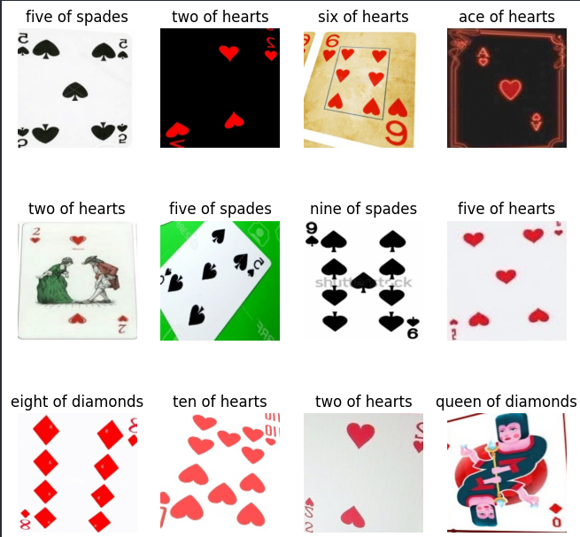
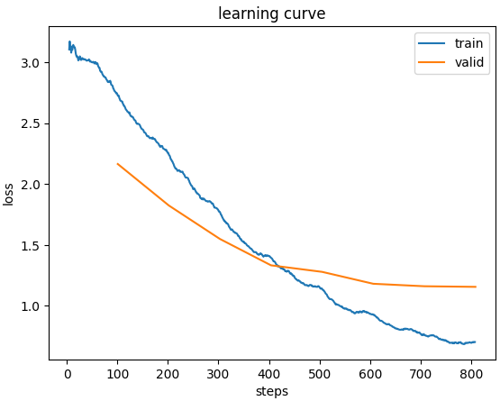
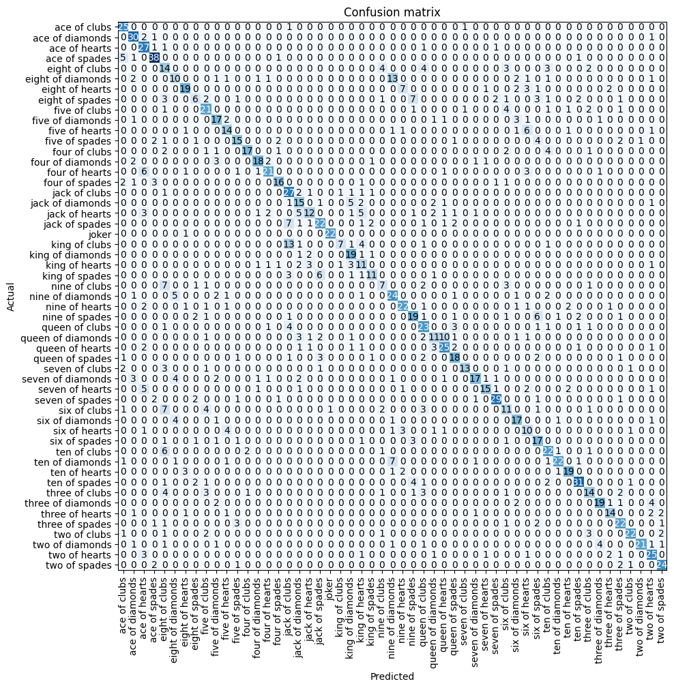

# Cards Image Classification

A multiclass image classification project for identifying playing cards (rank and suit) using fastai and ResNet18.

## Setup

1. Clone the repository:

   ```
   git clone https://github.com/OrKeren8/cards-image-classification.git
   cd cards-image-classification
   ```

2. Create and activate a virtual environment:

3. Install dependencies:

   ```
   pip install -r requirements.txt
   ```

4. Launch Jupyter Notebook:
   ```
   jupyter notebook
   ```

## Dataset

The dataset is sourced from Kaggle and includes images of playing cards with 53 classes (52 standard cards + joker). It is pre-split into train, test, and validation sets, located in the `cards_dataset/` folder.

- Total images: ~8,000
- Classes: 53
- Splits: Train (~7,600), Test (~265), Valid (~265)

## Model Performance

Final Validation Accuracy: 0.6975 (69.75%)

## Visualizations

**Sample Images**



**Training Loss Curve**



**Confusion Matrix**



## Project Structure

- `project.ipynb`: Main notebook with the full pipeline.
- `requirements.txt`: Python dependencies.
- `cards_dataset/`: Dataset folder (not included in repo; download separately if needed).
- `README.md`: This file.
